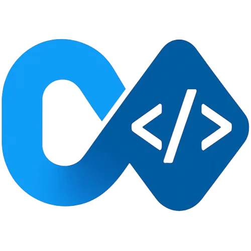
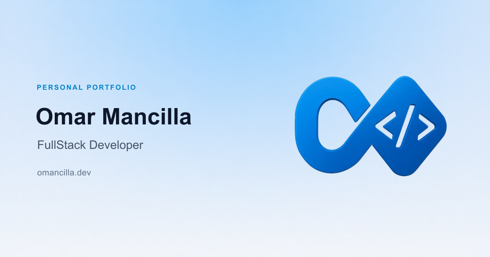

  

  <h1>Omar Mancilla</h1>

  
<strong>Full-stack developer crafting thoughtful web and mobile experiences.</strong>

  
Based in Mexico. Building digital products with purpose, clarity, and attention to detail.

  

    <a href="https://www.omancilla.dev">Portfolio</a>
    ·
    <a href="https://www.linkedin.com/in/omancilla">LinkedIn</a>
    ·
    <a href="mailto:contacto@omancilla.dev">Email</a>
  

## About this project

This is the home of my work on the web: a curated view of my experience, selected projects, and the technologies I use to bring ideas to life.

The portfolio is available in English and Spanish, adapts to light and dark themes, and is designed to feel fast, accessible, and personal on every screen.

## Inside the portfolio

- Professional experience and the work behind it
- Selected products across web and mobile
- The tools and technologies that shape my workflow

## Selected stack

`Astro` · `TypeScript` · `Tailwind CSS` · `React`
